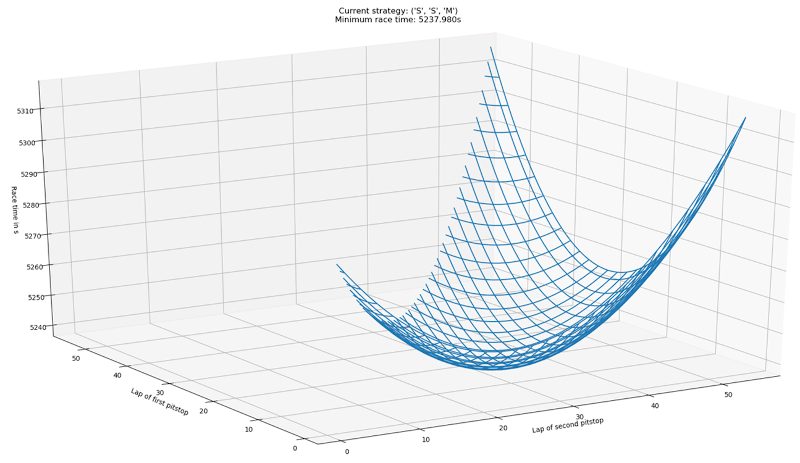
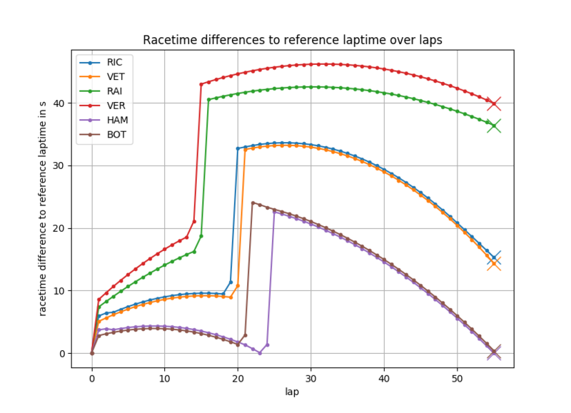

# Introduction
This repository contains a race simulation for the simulation of motorsport circuit races. The intended application is
the determination of an appropriate race strategy, i.e. of the pit stops (number of stops, inlaps, tire compound choice,
possibly refueling). The race simulation considers long-term effects such as mass reduction due to burned fuel and tire
degradation as well as the interactions between all race participants. It is based on a lap-wise discretization for fast
calculation times. Probabilistic influences are also modeled and can be evaluated using Monte Carlo simulation. For the
making of automated race strategy decisions, we developed the Virtual Strategy Engineer (VSE).

Many parts of this repository are focused on the Formula 1 racing series. However, most code can also be used for other
racing series.

Contact person: [Alexander Heilmeier](mailto:alexander.heilmeier@tum.de).

# List of components
* `helper_funcs`: The folder contains small helper functions that are used in more than one of the programs.
* `machine_learning`: The folder contains the source code of the preprocessor used to preprocess the data for the ANNs.
* `machine_learning_rl_training`: The folder includes the source code that is required for the training of the VSE based
on a reinforcement learning approach.
* `racesim`: The folder contains the source code required to simulate an entire race (`src` folder). The `input` folder
contains the required parameter files for every race, the `output` folder is created during execution and will then
contain .csv files with lap times, race times, and positions in each lap.
* `racesim_basic`: The folder contains the source code of a basic race simulation that calculates the best race strategy
(leading to a minimal race time) under the assumption of a free track, i.e. without opponents.

# Dependencies
Use the provided `requirements.txt` in the root directory of this repo, in order to install all required modules.\
`pip3 install -r /path/to/requirements.txt`

The code was developed with Python 3.8 on Windows 10 and tested with Python 3.8 on Ubuntu.

## Solutions for possible installation problems (Windows)
`cvxpy`, `cython` or any other package requires a `Visual C++ compiler` -> Download the build tools for Visual Studio
2019 (https://visualstudio.microsoft.com/de/downloads/ -> tools for Visual Studio 2019 -> build tools), install them and
chose the `C++ build tools` option to install the required C++ compiler and its dependencies

## Solutions for possible installation problems (Ubuntu)
1. `matplotlib` requires `tkinter` -> can be solved by `sudo apt install python3-tk`
2. `quadprog` requires `Python.h` -> can be solved by `sudo apt install python3-dev`
3. For building the `cvxpy` wheel you will need `sudo apt install build-essential`

# Intended workflow
The intended workflow is as follows:
1. Determine basic strategy: Use the simplified race simulation in `racesim_basic` to determine the fastest basic race
strategy. It can be used as a first guess for the race strategy in the race simulation.
2. (optional) Train reinforcement VSE: Train the VSE within the race simulation to make reasonable strategy decisions.
3. Evaluate and prepare final race strategy: Use the race simulation in `racesim` to simulate the race and to optimize
the race strategy. The VSE can be used for other participants if you do not want to determine all strategies manually.
Of course, it could also be used for the own driver.

## Running the basic race simulation
If the requirements are installed on the system, follow these steps:

* `Step 1`: You have to adjust a given or create a new parameter file (.ini) for the simulation. The parameter files
are contained in `/racesim_basic/input/parameters`.
* `Step 2:` Check the user inputs in the bottom part of `main_racesim_basic.py`.
* `Step 3:` Execute `main_racesim_basic.py` to start the race simulation.



## Running the VSE training
If the requirements are installed on the system, follow these steps:

* `Step 1`: You have to adjust a given or create a new parameter file (.ini) for the race to simulate. The parameter
files are contained in `/racesim/input/parameters`.
* `Step 2:` Check the user inputs in the upper part of `main_train_rl_agent_dqn.py`.
* `Step 3:` Execute `main_train_rl_agent_dqn.py` to start the training.

### Training of the reinforcement learning VSE
The RL VSE must be trained specifically for each race. This is possible by executing the `main_train_rl_agent_dqn.py`
script. The according source code for the setup of the RL environment etc. can be found in the
`machine_learning_rl_training` directory. After training, please copy the output files from that directory to
`racesim/input/vse` to make the trained DQN (deep Q-network) available to the race simulation. Pre-trained reinforcement
VSE are included for all available races except (partly) wet races.

For more information on the VSE, we refer to our paper `Virtual Strategy Engineer: Using Artificial Neural Networks for
Making Race Strategy Decisions in Circuit Motorsport` (more bibliographic details are listed below).

## Running the race simulation
If the requirements are installed on the system, follow these steps:

* `Step 1`: You have to adjust a given or create a new parameter file (.ini) for the race to simulate. The parameter
files are contained in `/racesim/input/parameters`.
* `Step 2:` Check the user inputs in the bottom part of `main_racesim.py`.
* `Step 3:` Execute `main_racesim.py` to start the race simulation.



### Contained parameter files
We included exemplary parameter files for the 121 Formula 1 races in the seasons from 2014 to 2019. They were
automatically created on the basis of our Formula 1 timing database (link is below). The program used for this was
developed by Marcel Faist as part of his master's thesis within the project. Please keep in mind that an exact
reproduction of the real races in the simulation is practically impossible.

### Virtual Strategy Engineer (VSE)
If activated in the bottom part of `main_racesim.py`, the virtual strategy engineer (VSE) determines the race strategies
of the race participants. It eases the handling for the user of the race simulation since he must not determine the
strategies of all race participants manually. Several variants of the VSE are available, which can be set separately for
each driver at the bottom of the race parameter files (`/racesim/input/parameters/*.ini`):
- base strategy (`basestrategy`)
- real strategy (`realstrategy`)
- VSE trained on real-world data (`supervised`)
- VSE trained within the race simulation (`reinforcement`)

With the `basestrategy` option, the VSE uses a pre-defined strategy (stored at the bottom of the parameter files as
well) that was optimized for a minimum race duration (under the assumption of a race without opponents). This was done
by using the basic strategy optimization in `main_racesim_basic.py`. With the `realstrategy` option, the strategies of
the real-world races are applied (stored at the bottom of the parameter files). With the `supervised` option, the VSE is
based on two artificial neural networks that were trained on real-world timing data to make the race strategy decisions.
Please keep in mind that our VSE is focused on Formula 1. Thus, it only determines whether a driver should come into the
pits and which tire compound should be fitted to the car. The `reinforcement` option activates a VSE that was trained
within the race simulation based on a reinforcement learning (RL) approach.

Before activating the `reinforcement` option, consider performing your own training instead of using one of the pre-
trained reinforcement VSE, see previous section. Pre-trained reinforcement VSE are included for all available races
except (partly) wet races. This is because the VSE is currently only implemented to handle dry compounds. The training
was performed against the supervised VSE. However, the resulting NNs werde not checked in terms of decision behavior. It
can therefore be suboptimal! The following eleven races were (partly) wet:
- Budapest 2014
- Suzuka 2014
- Austin 2015
- Silverstone 2016
- Monte Carlo 2016
- Sao Paulo 2016
- Silverstone 2016
- Shanghai 2017
- Singapore 2017
- Hockenheim 2018
- Hockenheim 2019

# Publications
## Detailed description of the race simulation (deterministic parts)
Please refer to our paper for further information:
```
@inproceedings{Heilmeier2018,
doi = {10.1109/itsc.2018.8570012},
url = {https://doi.org/10.1109/itsc.2018.8570012},
year = {2018},
month = nov,
publisher = {{IEEE}},
author = {Alexander Heilmeier and Michael Graf and Markus Lienkamp},
title = {A Race Simulation for Strategy Decisions in Circuit Motorsports},
booktitle = {2018 21st International Conference on Intelligent Transportation Systems ({ITSC})}}
```

## Detailed description of the race simulation (probabilistic effects and random events)
Please refer to our paper for further information:
```
@article{Heilmeier2020,
doi = {10.3390/app10124229},
url = {https://doi.org/10.3390/app10124229},
year = {2020},
month = jun,
publisher = {{MDPI} {AG}},
volume = {10},
number = {12},
pages = {4229},
author = {Alexander Heilmeier and Michael Graf and Johannes Betz and Markus Lienkamp},
title = {Application of Monte Carlo Methods to Consider Probabilistic Effects in a Race Simulation for Circuit Motorsport},
journal = {Applied Sciences}}
```

## Detailed description of the virtual strategy engineer (VSE)
Please refer to our paper for further information:
```
@article{Heilmeier2020,
doi = {10.3390/app10217805},
url = {https://doi.org/10.3390/app10217805},
year = {2020},
month = nov,
publisher = {{MDPI} {AG}},
volume = {10},
number = {21},
pages = {7805},
author = {Alexander Heilmeier and Andr{\'{e}} Thomaser and Michael Graf and Johannes Betz},
title = {Virtual Strategy Engineer: Using Artificial Neural Networks for Making Race Strategy Decisions in Circuit Motorsport},
journal = {Applied Sciences}}
```

# Related open-source repositories
* Lap time simulation: https://github.com/TUMFTM/laptime-simulation
* Race track database: https://github.com/TUMFTM/racetrack-database
* Formula 1 timing database: https://github.com/TUMFTM/f1-timing-database
